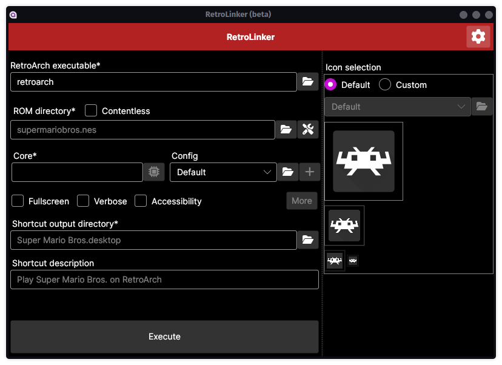
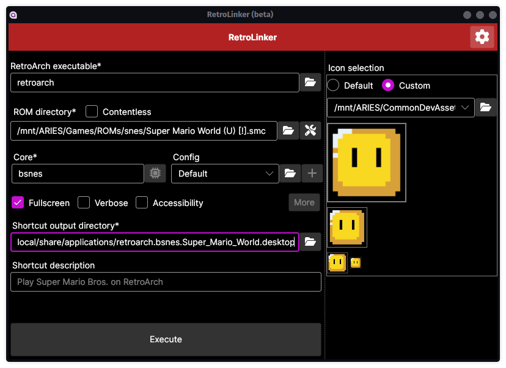
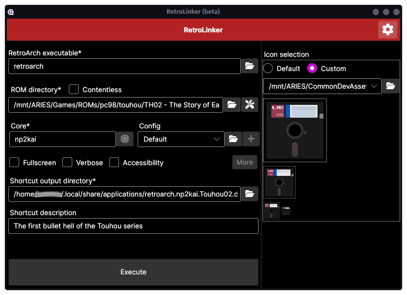
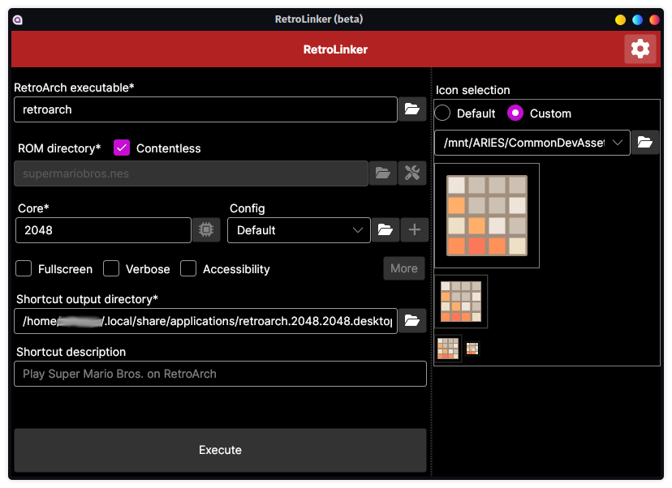
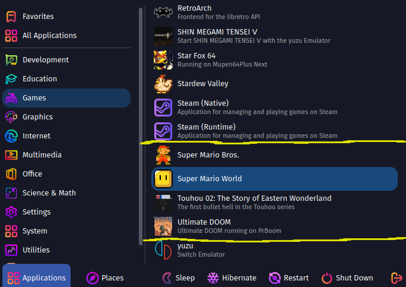

# RetroLinker
A helper for creating shortcuts of games that use libretro's emulator frontend RetroArch. It aims to help set most of the parameters that RetroArch takes and writes it to a shortcut file, along with shortcut an icon of your choice. Currently compatible with Windows Shortcut (.lnk) and linux desktop entry (.desktop).

As Windows Shortcuts can only use .ico for its icons, RetroLinker comes ready for converting .png, .jpeg and .svg images into .icos, as well to extract .icos from other Windows executable files (.exe only for now), that way you'll have more freedom on your icon choices!

## Features
- Let the user create a custom link per game for desktop integration.
- In Windows, the user can select .PNGs, .JPGs or .SVGs and convert them to .ICOs to use them on their links.
- Has a list of recommended output directories for better desktop integration.
- In Linux, it auto assigns executable permissions to the link for a seamless experience.
- For faster link creation, commonly used icons and Configs files can be stored via the app settings.
- Ready to be translated in multiple languages.

## Compatible RetroArch parameters
- core*
  - with content
  - contentless
- rom soft-patching
- custom Config file
- fullscreen
- verbose
- accessibility

## Captures

In the following capture, we can see that the example from before are now part of the Games category on the system apps menu.

## Planned RetroArch parameters
- core subsystems
- append config

## Restrictions
- This app won't ask for admin permissions; reading and writing to paths without the proper permissions will simple result in an error.
- This app won't check if the core really exist, or if the executable is really RetroArch's, so user miss-inputs will likely create an undesirable link.   

***This app is currently work-in-progress.***