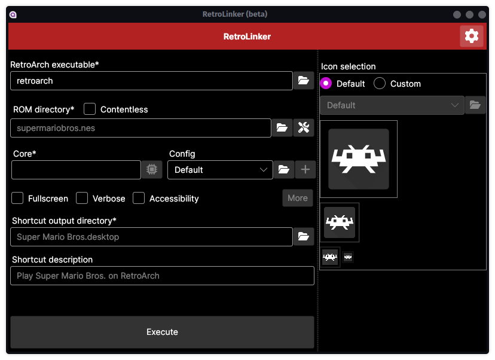
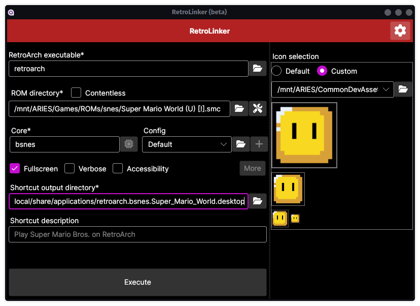
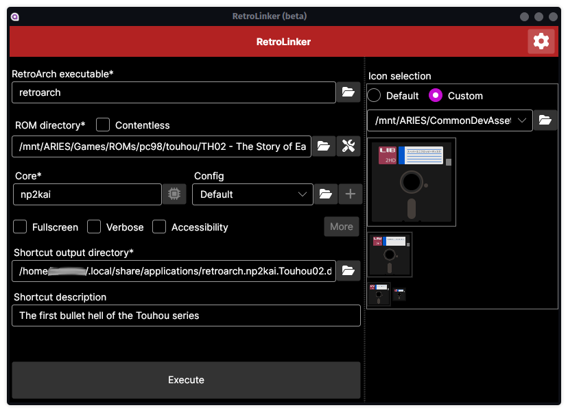
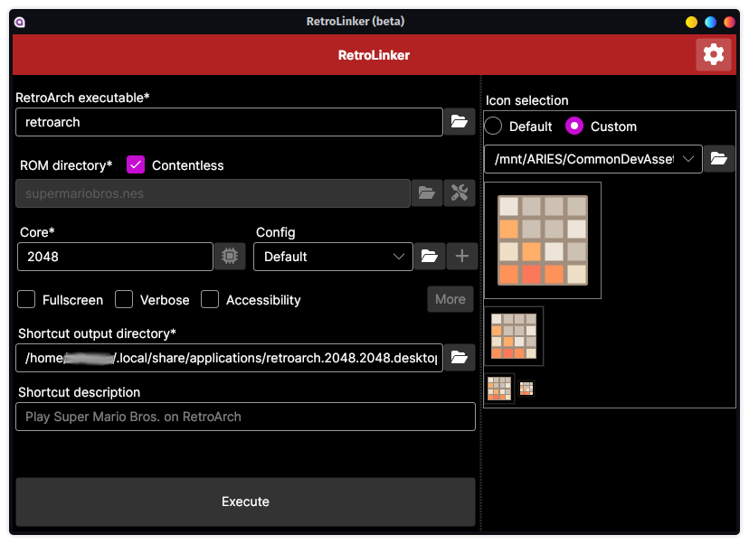
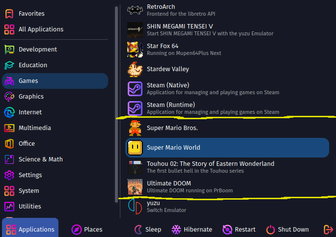

# RetroLinker
A helper for creating shortcuts of games that use Libretro's emulator frontend RetroArch. It aims to help set most of the parameters that RetroArch takes and writes it to a shortcut file for you, along with an icon of your choice. Currently compatible with the Windows shortcut (.lnk) and Linux desktop entry (.desktop) [(FreeDesktop spec)](https://specifications.freedesktop.org/desktop-entry-spec/latest/).

As Windows Shortcuts can only use .ico files for its icons, RetroLinker comes ready for converting .png, .jpeg and even .svg images into .ico files, as well to extract .ico files from other Windows executable files (.exe only for now), that way you'll have more freedom on your icon choices!

## Features
- Let the user create a custom link per game for desktop integration.
- In Windows, the user can select .PNGs, .JPGs or .SVGs and convert them to .ICOs to use them on their links.
- Has a list of recommended output directories for better desktop integration.
- In Linux, it auto assigns executable permissions to the link for a seamless experience.
- For faster link creation, commonly used icons and Configs files can be stored/remembered via the app settings.
- Integration with [TileIconifier.Net](https://github.com/kevinrmartinez/TileIconifier.Net) to create dedicated Tile icons for Windows8/10.
- Ready to be translated in multiple languages.

## Compatible RetroArch parameters
- core*
  - with content
  - contentless
- core subsystems
- rom soft-patching
- custom Config file
- appending Config files
- fullscreen
- verbose
- accessibility
- load menu on error

## Captures








In the following capture, we can see that the example from before are now part of the Games category on the system apps menu.  


## Planned RetroArch parameters
- log-file
- environment variables (all)

## Restrictions
- This app won't ask for admin permissions (yet); reading and writing to paths without the proper permissions will simply result in an error.
- This app won't check if the core really exist, or if the executable is really RetroArch's, so user miss-inputs will likely create an undesirable link.   

## Downloads
Check the latest release in the [Releases](https://github.com/kevinrmartinez/RetroLinker/releases/latest) page. 

## Build
You would need: 
- clone this repo: `git clone https://github.com/kevinrmartinez/RetroLinker.git` 
- [.NET SDK 10.0](https://dotnet.microsoft.com/en-us/download/dotnet/10.0) installed on your system 
- Around 1.7 GB of free space for the third party packages (NuGets) that will be downloaded.

To build for your current system, simply run the following command inside the RetroLinker.Desktop folder:  
```
dotnet build
```
The resulting files will be under bin/Debug/net10.0 in that same folder.

To build in a configuration for everyday use, run the following command inside the RetroLinker.Desktop folder:  
```
dotnet publish -c Release -o <desired/output/path>
```  
This will create a 'portable' release of the app, it can run as long .NET 10.0 is installed. More on `dotnet publish` [here](https://learn.microsoft.com/en-us/dotnet/core/tools/dotnet-publish)

If you want to copy the release configuration the releases use, you will need the [.NET Runtime ID](https://learn.microsoft.com/en-us/dotnet/core/rid-catalog#known-rids) of your platform, and run the following command inside the RetroLinker.Desktop folder:   
```
dotnet publish --no-logo -c ReleaseAoT -r <runtime-id> -o <desired/output/path>
```
If you are building for a platform already covered by our releases, you can run the script appropriate for your OS from the [RetroLinker.Destop/Scripts](../RetroLinker.Desktop/Scripts) folder.  
The option `-c ReleaseAoT` creates an executable for your platform, completely skipping over the dotnet runtime. But it has platform restrictions, you can learn more [here](https://learn.microsoft.com/en-us/dotnet/core/deploying/native-aot/?tabs=windows%2Cnet9plus#platformarchitecture-restrictions).
If you find yourself against this restriction, you can replace ReleaseAoT with: `-c Release -p:PublishSingleFile=true -p:PublishTrimmed=true`. The command will look like this:  
```
dotnet publish --no-logo -c Release -r <runtime-id> -p:PublishSingleFile=true -p:PublishTrimmed=true -p:DebugSymbols=false -o <desired/output/path>
```

### Building Restrictions
AvaloniaUI, the framework used for the graphic interface, and the current image manipulation solution, Magick.NET, have a total of 3 hard dependencies on desktop that only serves compiled libraries on select platforms:

- Windows: x86, x64, ARM64
- Linux (glibc): x64, ARM64
- Linux (musl): x64
- macOS: x64, ARM64

If your platform is anything other than that, you will need to compile its libraries for the target system. These C++ libraries are:

- libHarfBuzzSharp v8.3.1.3 ([reference](https://github.com/mono/SkiaSharp/blob/v3.119.4/documentation/dev/packages.md))
- libSkiaSharp v3.119.4 ([guide](https://github.com/mono/SkiaSharp/tree/v3.119.4#building-skiasharp))
- Magick.Native-Q8 v14.17.1 ([guide](https://github.com/dlemstra/Magick.NET/blob/main/docs/Readme.md))

### Building for macOS
Not Compatible.  
The project will most likely compile for macOS with no problems, but the resulting binary will (for now) **behave like in Linux**, and will try to create a FreeDesktop's desktop entry.
Running it like this it's **NOT RECOMMENDED**, as it is untested territory. Support for macOS is planned, I just don't have the enviroment to test it.

## Contributing
Not much to say. Contributions are welcome via forking: fork from the **dev** branch, do your amazing contribution, and create a pull request to the **dev** branch.